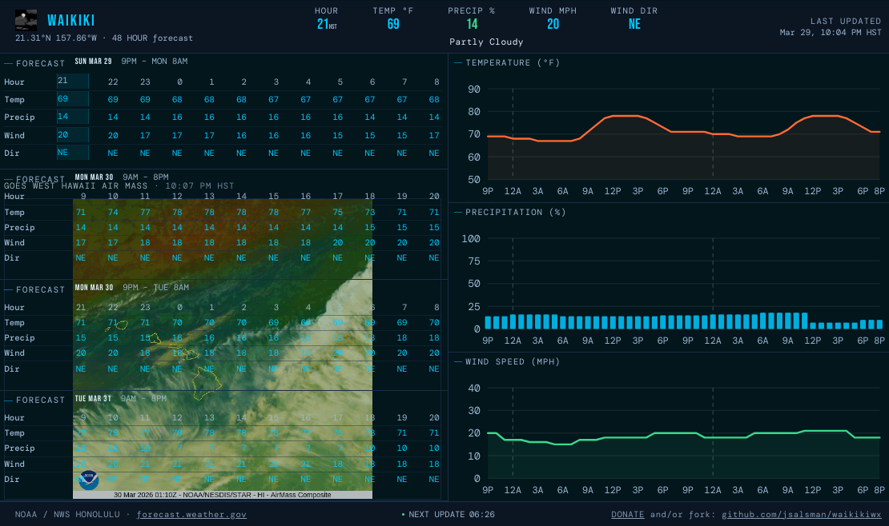

# waikikiwx

Single-page live 48-hour weather forecast dashboard for Waikiki, Honolulu, Oahu, Hawaii.

[](https://waikikiwx.live/)
[](https://waikikiwx.live/health-check)
[](https://www.python.org/downloads/)
[](https://flask.palletsprojects.com/)
[](https://opensource.org/licenses/MIT)
[](https://paypal.me/jsalsman)

URL: https://WaikikiWX.live



## What is shown

- 48 hours of hourly forecast data from `api.weather.gov`
- Header “now” values (Hour, Wind Dir, Wind mph, Temp, Precip)
- Current `shortForecast` summary text below the five header metrics
- Current hourly forecast icon shown left of the **WAIKIKI** title
- The same current icon is applied as the browser favicon dynamically
- GOES West Hawaii Air Mass animation overlay over the lower (25–48h) table zone

The primary data source for this dashboard is the National Weather Service (NWS) API (`api.weather.gov`). By querying the specific grid coordinates for Waikiki, the application retrieves highly localized, hourly forecast data. This includes quantitative metrics such as expected temperature, wind speed and direction, wind gusts, apparent temperature (incorporating heat index and wind chill), precipitation probability, and expected precipitation amount. Notably, the standard NWS data does not calculate wind chill for temperatures above 50°F, and the standard formula mathematically fails to reduce perceived temperatures in warm conditions; to compensate for this and provide a more accurate localized apparent temperature, the dashboard fetches grid `relativeHumidity` and automatically applies the Australian Apparent Temperature formula to apparent temperatures between 50°F and 80°F whenever wind is present. The NWS API also supplies qualitative data in the form of `shortForecast` text summaries and corresponding weather icons for each forecasted hour.

In addition to the localized forecast, the dashboard integrates satellite imagery from the NOAA GOES West satellite, specifically sourced from the NESDIS STAR (Center for Satellite Applications and Research) content delivery network. The application dynamically fetches the latest "Air Mass"-colored animated GIFs for the Hawaii and Tropical Pacific West sectors. Air Mass imagery highlights the temperature and moisture characteristics of different air masses, making it easier to visually analyze large-scale weather systems, fronts, and atmospheric dynamics leading to precipitation.

These distinct data streams are synthesized into a comprehensive and unified visual display. The numerical NWS data is rendered into precise hourly tables and SVG graphs, where primary metrics (temperature, precipitation probability, and wind speed) are shown as solid lines or solid bars, and secondary metrics (apparent temperature, expected precipitation amount, and wind gust speed) are depicted as dashed lines or dashed overlays. The GOES Air Mass satellite animations are strategically applied as semi-transparent, looping background overlays on top of the lower table zone (representing forecast hours 25 through 48), providing users with a macro-level visual context of the atmospheric conditions.

## Local run

```bash
python -m pip install -r requirements.txt
python app.py
```

Then open:

- `http://127.0.0.1:8080/` for the dashboard
- `http://127.0.0.1:8080/forecast` for JSON consumed by the front-end
- `http://127.0.0.1:8080/goes-airmass` for latest GOES West HI Air Mass GIF URL
- `http://127.0.0.1:8080/health-check` for application health status
- `http://127.0.0.1:8080/icon?url=...` for NWS icon proxying
- `http://127.0.0.1:8080/screenshot.png` for the open graph screenshot image
- `http://127.0.0.1:8080/robots.txt` for crawler rules
- `http://127.0.0.1:8080/cron/collect-forecast?key=YOUR_SECRET_KEY` for triggering the GCS forecast export

## Historical Data Collection

The application includes a specialized endpoint (`/cron/collect-forecast?key=YOUR_SECRET_KEY`) designed to periodically save forecast snapshots to a Google Cloud Storage bucket (`waikikiwx`). This historical dataset will eventually be used to compute 50% confidence intervals for temperature, precipitation probability, and wind speed.

### Configuration
1. Set the `COLLECT_FORECAST_KEY` environment variable in your Google Cloud Run service to a secure, random string (e.g., `YOUR_SECRET_KEY`).
2. The service account running the Cloud Run application must have write access to the `waikikiwx` GCS bucket.

### Automation via Google Cloud Scheduler
To automate this collection using [Google Cloud Scheduler](https://cloud.google.com/scheduler/docs/creating):
1. Create a new Cloud Scheduler job.
2. Set the frequency to every 10 minutes (e.g., `*/10 * * * *`).
3. Set the target type to HTTP and the URL to `https://waikikiwx.live/cron/collect-forecast?key=YOUR_SECRET_KEY` (replacing `YOUR_SECRET_KEY` with the exact string you used for the `COLLECT_FORECAST_KEY` environment variable).

The endpoint saves a JSON file for each execution at `gs://waikikiwx/forecast-YYYY-MM-DD-HH-MM.json` (using Hawaii-Aleutian Standard Time).

## Quick validation checklist

1. Start app and request `/forecast`; confirm JSON includes:
   - `hour`, `direction`, `speed`, `temp`, `precip`
   - `icon` and `short` arrays for hourly icon + shortForecast text
2. Load `/` and view source/DOM to confirm:
   - `` exists in header left of title
   - `<div id="now-summary">` exists under the center metric row
   - `<link rel="icon">` updates to current hour `icon` URL after refresh
3. Confirm mobile portrait layout stacks charts first, then tables.

## Repository file tree and component descriptions

```text
waikikiwx/
├── app.py                  # Flask application: routes, upstream API fetch logic, parsing, and JSON/template responses
├── index.html              # Single-page Jinja template containing all markup, styles, and dashboard client-side logic
├── Dockerfile              # Container build definition for production Cloud Run execution with Gunicorn
├── cloudbuild.yaml         # Google Cloud Build pipeline for smoke tests, image build/push, and Cloud Run deploy
├── requirements.txt        # Python dependency lock list used locally, in Docker, and in CI
├── tests/
│   ├── test_app.py         # Backend/unit-style endpoint coverage using Flask test_client + API mocking
│   └── test_playwright.py  # End-to-end Playwright UI validation with screenshot/video artifacts
├── screenshot.png          # Open Graph/social preview image served by the app
├── LICENSE                 # MIT license terms for project usage and distribution
├── README.md               # Project overview, usage, validation steps, and architecture notes
└── AGENTS.md               # Repository automation instructions used by development agents
```

`app.py` is the backend control plane for the whole project. It initializes Flask, defines canonical Waikiki coordinates, discovers the weather.gov forecast/grid endpoints from the points API, and normalizes heterogeneous upstream data into a consistent 48-hour hourly payload consumed by the front end. It includes helper parsing utilities for wind strings and ISO-8601 valid-time windows, merges hourly and grid datasets (temperature, apparent temperature, gusts, precipitation probability, and quantitative precipitation), and applies sensible fallback behavior when sparse values are missing. It also provides operational and support endpoints (`/health-check`, `/icon`, `/goes-airmass`, `/screenshot.png`, `/robots.txt`, and `/cron/collect-forecast`) in addition to serving `/` and `/forecast`, so the single module effectively handles rendering, API aggregation, and proxy-safe access patterns in one place.

The `index.html` template is intentionally a self-contained UI surface: Jinja injects initial forecast data while vanilla JavaScript performs refresh/update behavior, DOM binding, icon updates, GOES overlay swapping, and SVG graph drawing without any framework dependency. Its CSS uses a responsive, terminal-inspired layout with flexbox, viewport-aware scaling variables, and explicit mobile portrait behavior so the same document works on phones, tablets, and desktop displays. The page combines four stacked forecast table blocks, three chart panels, and a dynamic “now” status strip, while also managing favicon updates and weather icon rendering for immediate visual context. In short, this file is both the view layer and the client runtime for the dashboard.

The `Dockerfile` packages the app for production in a minimal Python 3.14 slim image, prioritizing predictable startup and safer runtime defaults. It sets Python environment flags for cleaner container behavior, creates and runs as a non-root `appuser`, installs requirements in a cache-friendly layer, and copies only the files needed at runtime (`app.py`, `index.html`, `screenshot.png`). The container exposes port 8080 and starts Gunicorn with multiple workers and a bounded timeout, aligning with Cloud Run expectations while preserving a simple image build path that mirrors local behavior.

`cloudbuild.yaml` defines the CI/CD pipeline from validation through deployment. The first step (`Smoketests`) runs inside `python:3.14-slim` and does more than a superficial ping: it compiles all Python files, creates a virtual environment, installs dependencies, starts the Flask development server, installs `curl`, and verifies that the homepage response contains an expected sentinel string (`and/or fork:`), failing fast with response diagnostics if not. After this gate passes, the pipeline builds a no-cache Docker image, pushes it to Artifact Registry, and updates the Cloud Run service in `us-west1` using commit-based image tags and deployment labels for traceability. That smoketests stage is therefore the quality gate that protects the deploy stages from shipping obviously broken application behavior.

## Daily YouTube Shorts Automation

A Python script (`daily_short.py`) is included to automate generating and uploading a 60-second YouTube Short of the live dashboard. The script leverages Playwright to record a headless session, FFmpeg to clip/format it into an MP4, and the YouTube API to upload it. It fetches OAuth credentials from Google Secret Manager to bypass Service Account upload restrictions.

### Deployment as a Cloud Run Job

To deploy this script as a Cloud Run Job to be run via Cloud Scheduler:

```bash
# Build and push the updated image (or let Cloud Build do it)
# Deploy as a new Cloud Run Job:
gcloud run jobs create waikikiwx-daily-short \
  --image gcr.io/YOUR_PROJECT_ID/waikikiwx:latest \
  --command "python" \
  --args "daily_short.py" \
  --region us-west1 \
  --set-env-vars="GOOGLE_CLOUD_PROJECT=YOUR_PROJECT_ID"
```

Then create a Cloud Scheduler trigger to run it daily:
```bash
gcloud scheduler jobs create http waikiki-short-trigger \
  --schedule="0 8 * * *" \
  --uri="https://us-west1-run.googleapis.com/apis/run.googleapis.com/v1/namespaces/YOUR_PROJECT_ID/jobs/waikikiwx-daily-short:run" \
  --http-method POST \
  --oauth-service-account-email="YOUR_SERVICE_ACCOUNT_EMAIL"
```
